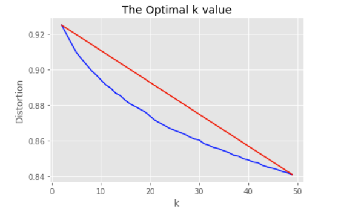

# Covid-19 

#### Project Motivation
* There are thousands of research papers written on Covid-19. To find a vaccine the doctors, scientists must go through every research paper to find relevant articles.
* The solution to this problem is to create groups or cluster relevant articles together.
* Hence, my motivation behind this project was to help the community by clustering relevant articles together to help find a vaccine on Covid-19.

#### Goal of this project:
* To cluster different research papers together under one section.
* Apply NLP techniques to process the text information based on title, abstract and summary.
* Create clusters by using K-Means algorithm

## The steps taken in the Project

#### Data Preprocessing 

* Splitting the words form abstract and body text

  

* Eliminating duplicates

  

* Eliminating null values

  

* Plotting Unique word count 

  

* Landetect package to identify different languages

  

* Plotting different languages

  

* Converting raw document to matrix of tf-idf features

  

* Reducing the dimensions of vectorised data using PCA

  

* Plotting distortions using Elbow Method to find the optimal K value

  

* Using K-means clustering, plotting the data

  

