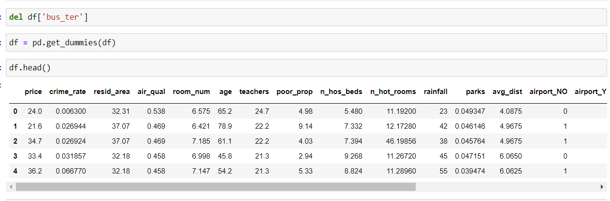
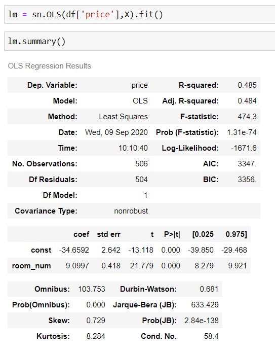

# Linear Regression performed on the House Pricing data

## Reading data

* Reading data from CSV

  

## Plotting the data

* Price vs N_hot_rooms

  

* Price vs rainfall

  

* Airport data

  

* Waterbody data

  

## Outliers 

* Eliminating outliers for n_hot_rooms

  

## Normalizing Data 

* Applying log function to crime rate

  

## Convertion of Categorical data

* Converting categorical data to dummy data 

  

## Correlation Matrix

  

## Stats Model

  

## Linear Regression Model

  

## Plotting Regression Line

  

## Multiple Linear Regression

  

* Accuracy after splitting the data into training and testing

  

* Ridge Regression

  

* Lasso Regression

  

